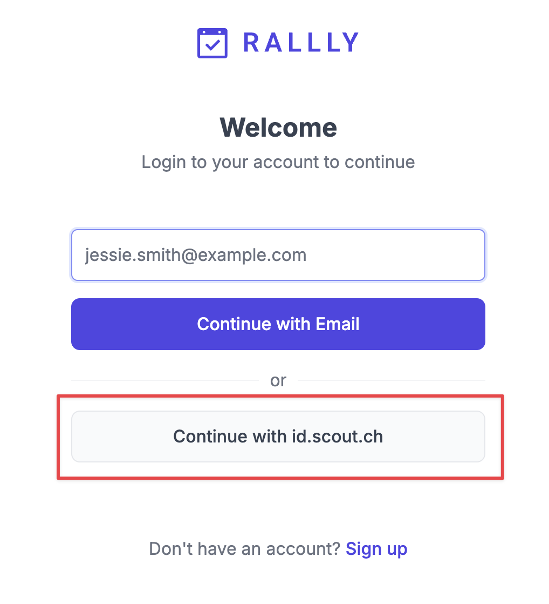
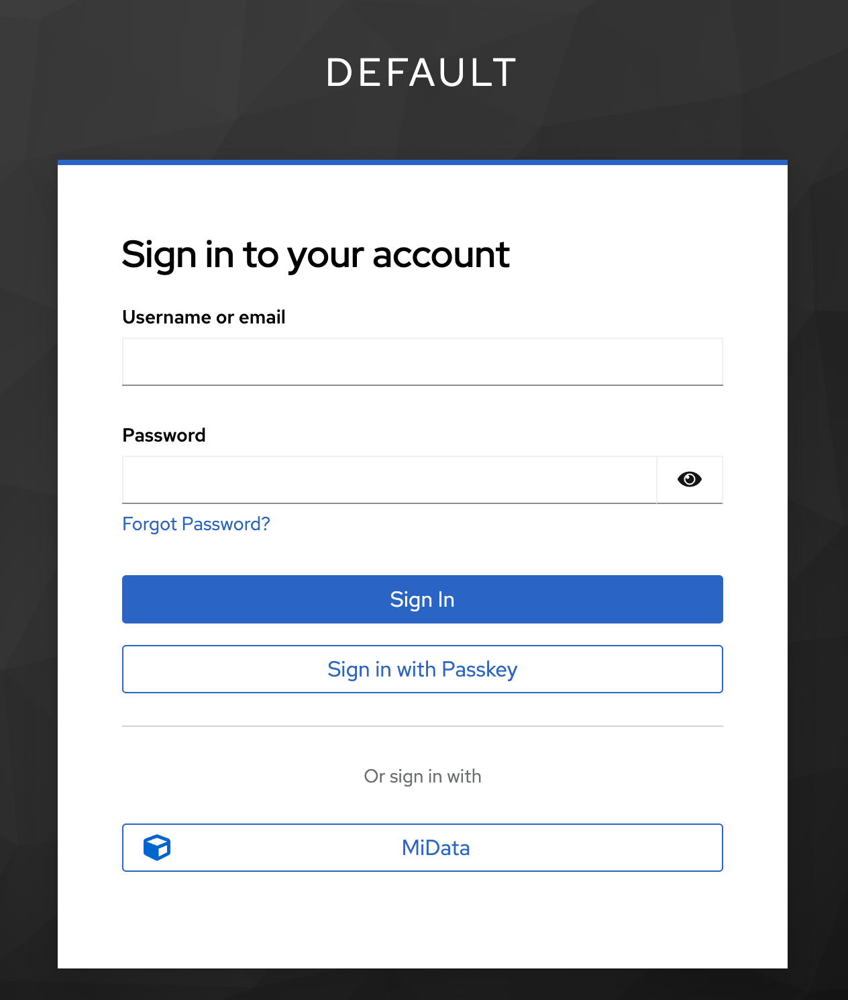
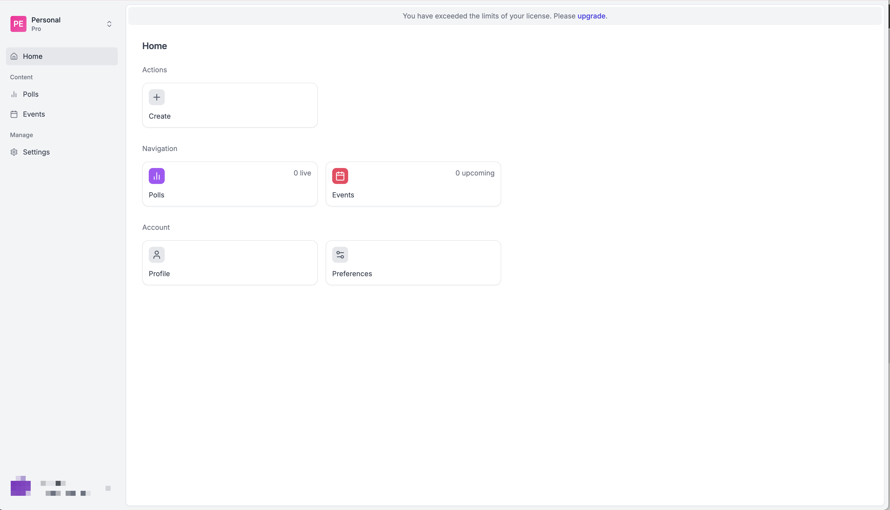
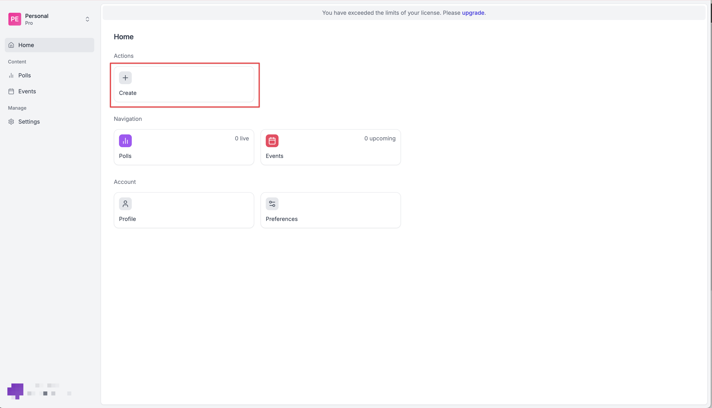

# Rallly

We can use the group scheduling tool instead (e.g., Doodle), which is run by the Swiss Scout and Guide Movement.
In this article, you'll find documentation on how to sign up, log in, or create a new poll.

## Sign-up

Even during your first sign-in, you don't have to click on `Sign-up`. You can click on `Continue with id.scout.ch`.

Then you'll be forwarded to MiData (`db.scout.ch`). Please authenticate your login request, and then you are ready to start creating your first poll.

Please authorize the login/registration.

Congrats! You are successfully logged in to your account.

## Add a new poll

## Add a new poll

To add a new poll within Rallly, you need to be logged in on `rallly.scout.ch`.

Click on the highlighted field to create a new poll.

Then you are able to add all information, possible meeting dates & times, and some comments. At the bottom of the form, you can configure your poll with some additional features. The `Pro`-features are also

## Support
If you have any questions regarding Rallly, do not hesitate to contact the IT Team.
[Contact Support](https://docs.jamboree.ch/docs/support){: